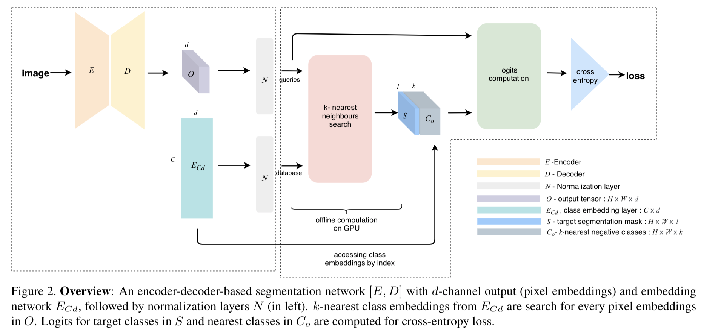

# ESSNet - Embedding-based Scalable Segmentation Network



## Scaling Semantic Segmentation Beyond 1K Classes on a Single GPU


In our embedding-based scalable segmentation approach, we reduce the space complexity of the segmentation model's output from O(C) to O(1), propose an approximation method for ground-truth class probability, and use it to compute cross-entropy loss. The proposed approach is general and can be adopted by any state-of-the-art segmentation model to gracefully scale it for any number of semantic classes with only one GPU. Our approach achieves similar, and in some cases, even better mIoU for Cityscapes, Pascal VOC, ADE20k, COCO-Stuff10k datasets when adopted to DeeplabV3+ model with different backbones. We demonstrate a clear benefit of our approach on a dataset with 1284 classes, bootstrapped from LVIS and COCO annotations, with three times better mIoU than the DeeplabV3+ model.

**Instructions to use**

Clone our github repository
```
git clone https://github.com/shipra25jain/ESSNet.git
```
Create and activate conda environment
```
conda env create -f environment.yml
conda activate env
```
To visualize training loss and performance of model in visdom, run
```
visdom -port 28333
```
To train the model for ADE20k dataset, run
```
python3 main.py --model deeplabv3plus_mobilenet --enable_vis --vis_port 28333 --dataset ade20k --gpu_id 0  --lr 0.01 --crop_size 512 --batch_size 10 --output_stride 16 --reduce_dim --data_root ade20k/data --loss_type nn_cross_entropy --num_channels 12 --num_neighbours 7 --vis_env ade20k_normalization_resnet50 --lr_policy multi_poly --checkpoint_dir ade20k_checkpoints
```
To evaluate the trained checkpoint, run
```
python3 main.py --model deeplabv3plus_mobilenet --enable_vis --vis_port 28333 --dataset ade20k --gpu_id 0  --lr 0.01 --crop_size 512 --batch_size 10 --output_stride 16 --reduce_dim --data_root ade20k/data --loss_type nn_cross_entropy --num_channels 12 --num_neighbours 7 --vis_env ade20k_normalization_resnet50 --lr_policy multi_poly --checkpoint_dir ade20k_checkpoints --ckpt ade20k_checkpoints/best_deeplabv3plus_mobilenet_ade_os16.pth --test_only --crop_val
```
The code supports ADE20k, Cityscapes, Pascal VOC, COCO-Stuff20k and COCO+LVIS dataset. Modify dataset name, appropriate number of channels, required backbone and other parameters in the above commands. If you do not want to use visdom for visualization, remove --enable_vis --vis_port 28333 from above commands.
